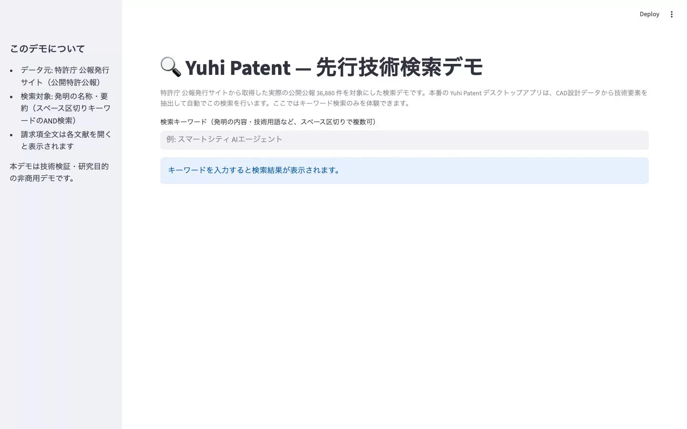
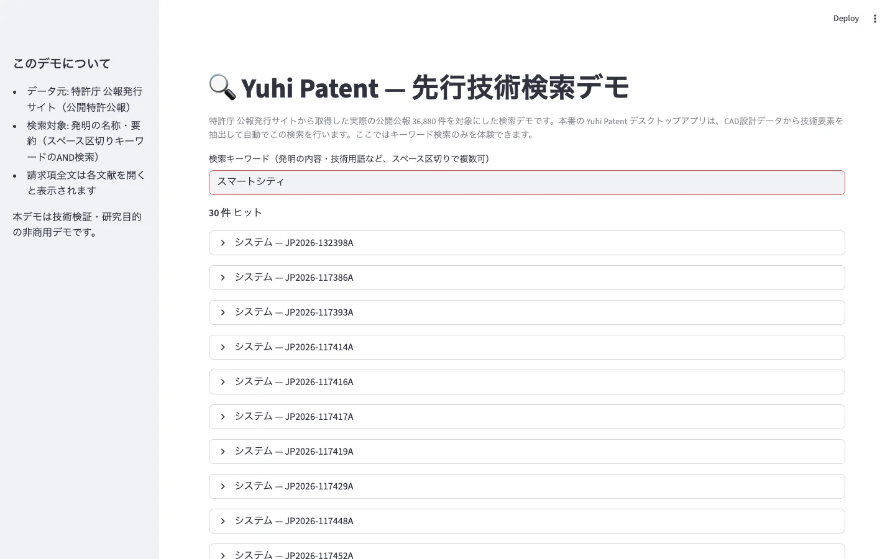

# Yuhi Patent — Streamlit Demo

Search demo over the JPO gazette corpus (real published patent gazettes),
separate from the Yuhi Patent desktop app. The desktop app is local-first and
does not ship JPO data — users import their own corpus. This demo exists so
people can try full-text search without installing anything.

**Status: this repository is currently private, and no instance is deployed
to Streamlit Community Cloud yet.** The screenshots below are from a local
run (`streamlit run streamlit_app.py`). To get a public URL, deploy this repo
on [share.streamlit.io](https://share.streamlit.io) (see "Deploying" below).

## What it looks like

| Home | Search results |
| --- | --- |
|  |  |

Keyword search over title/abstract across 36,880 real published patent
gazettes; opening a result shows the full claims text.

## Local run

```bash
pip install -r requirements.txt
streamlit run streamlit_app.py
```

## Rebuilding `patents.db`

```bash
python3 build_db.py /path/to/docs.jsonl patents.db
```

`docs.jsonl` is produced by `corpus-tools/fetch-gazette.mjs` (one JSON object
per line: `publication_number`, `title`, `abstract`, `claims`).

## Deploying

Push this repo to GitHub (or a mirror of it), then deploy on
[Streamlit Community Cloud](https://share.streamlit.io) pointing at
`streamlit_app.py`. This is a manual, one-time setup step — nothing here
auto-deploys.
